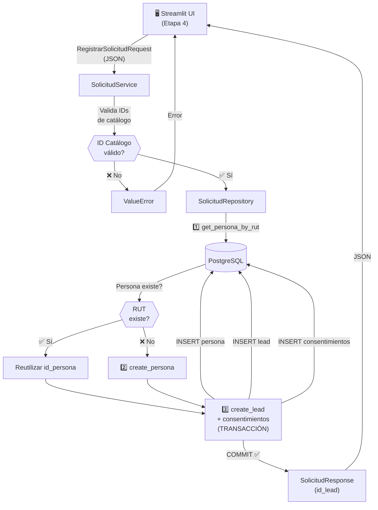
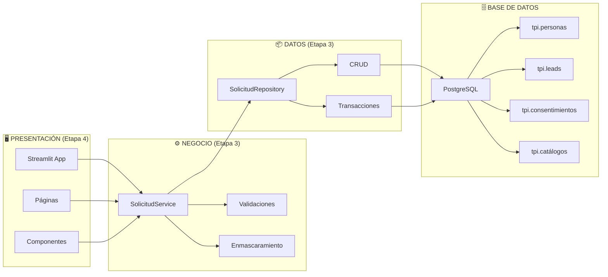
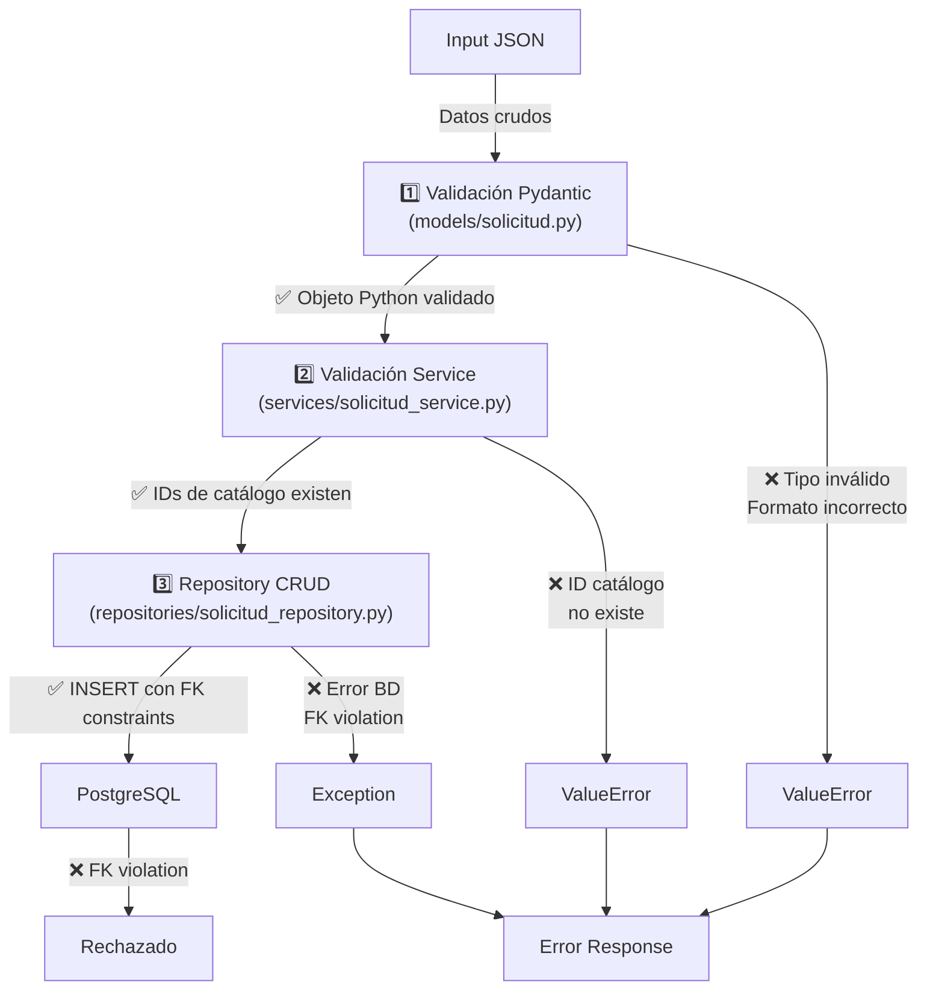
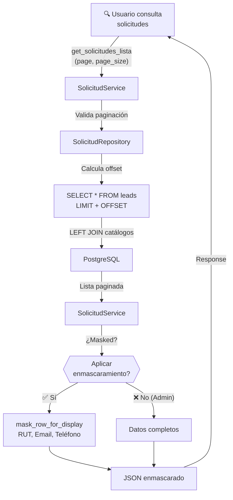
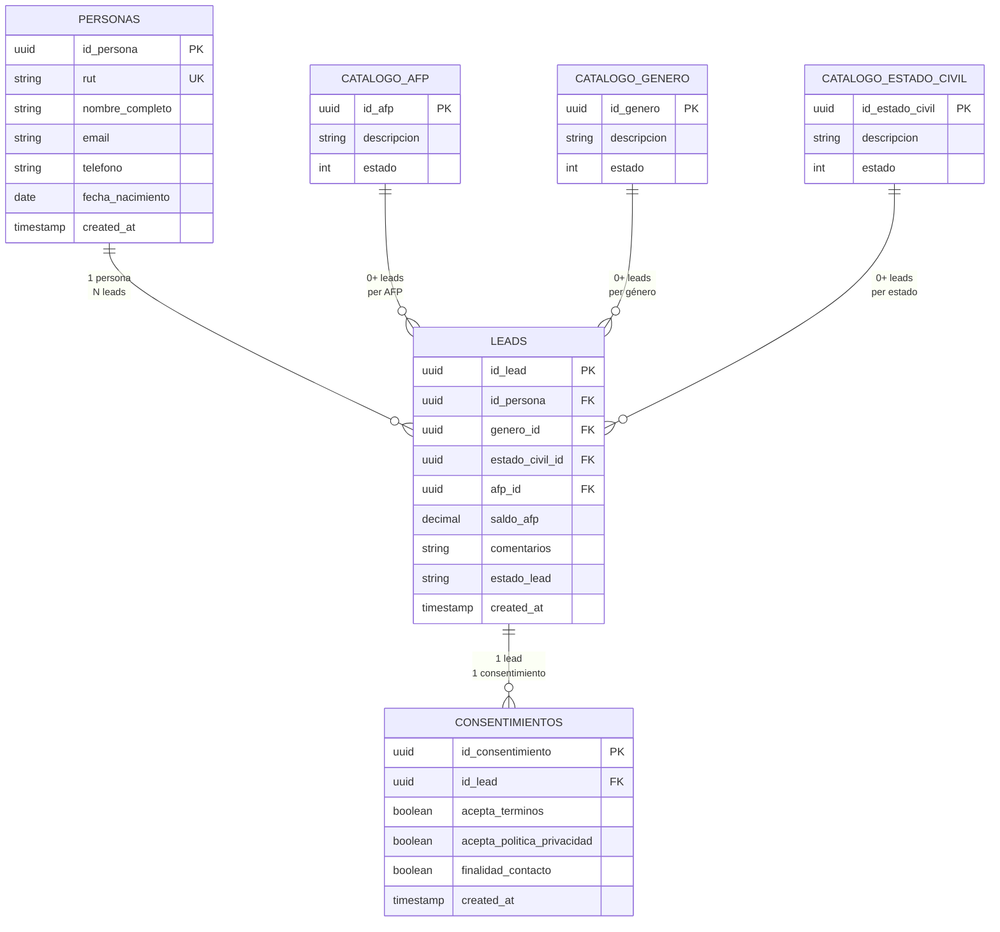
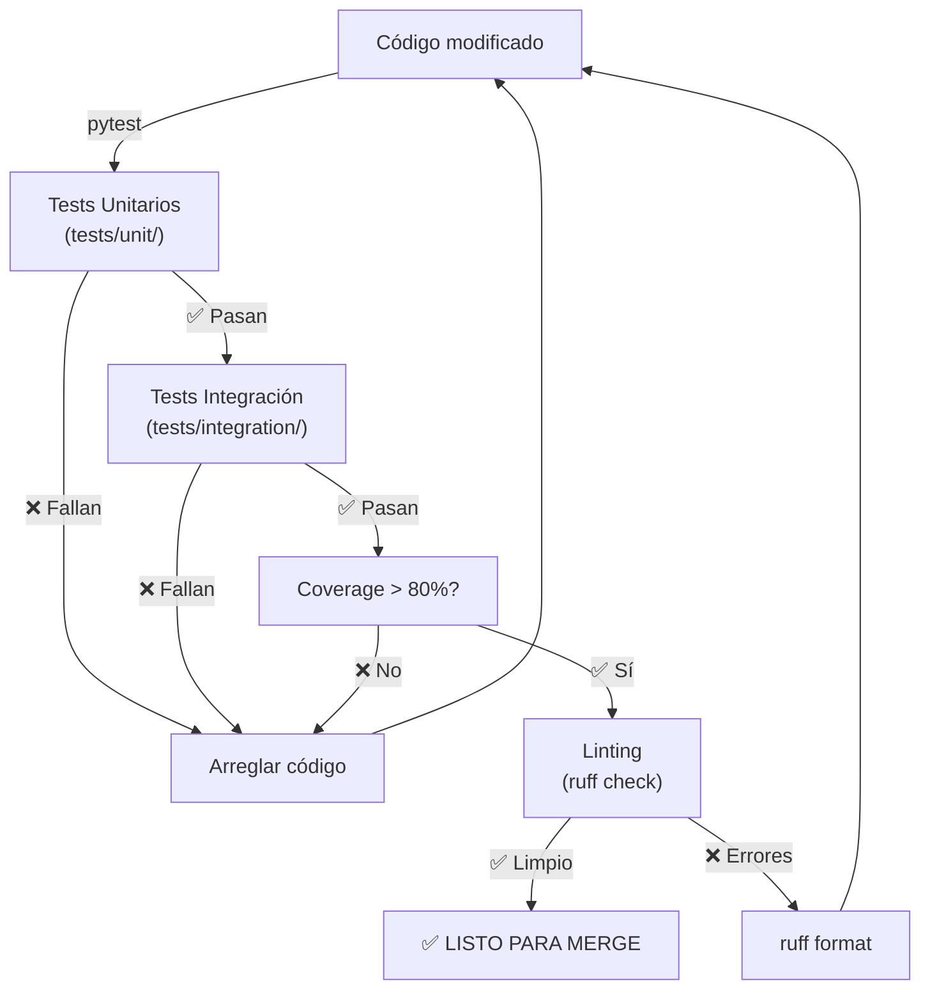
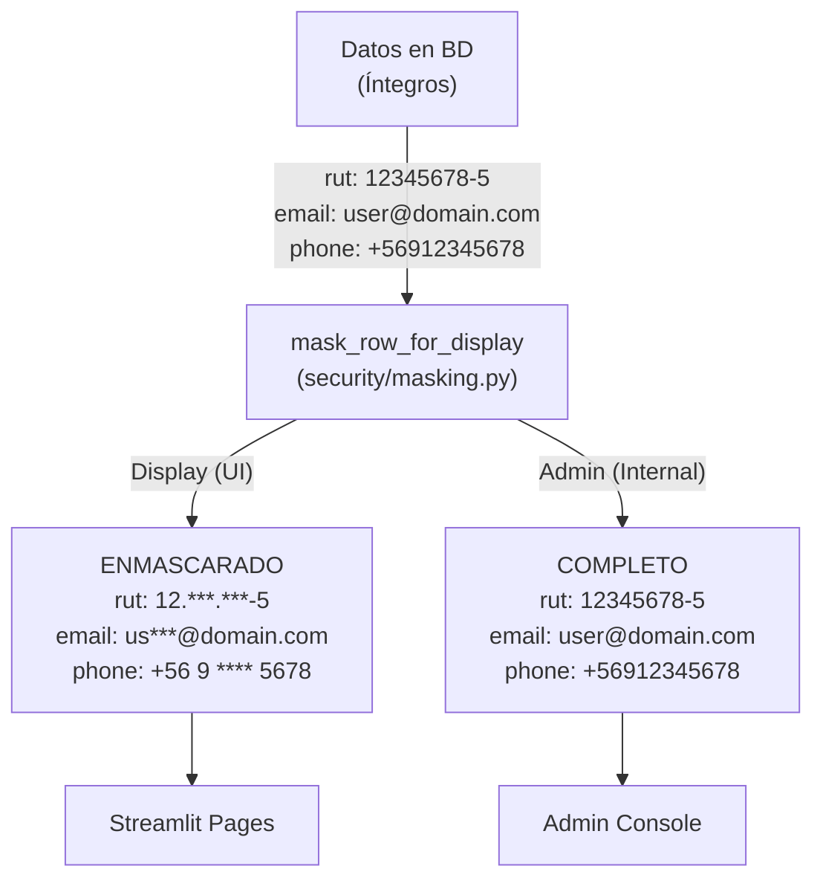
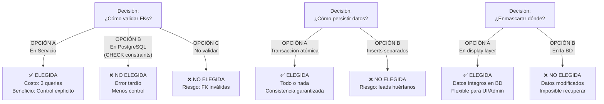

# Diagrama de Arquitectura - Etapa 3

## Flujo de Registro de Solicitud

## Arquitectura en Capas

## Validación en Tres Niveles

## Flujo de Consulta de Solicitudes

## Tablas y Relaciones

## Ciclo de Testing

## Enmascaramiento de Datos

## Decisiones de Diseño - Alternativas

---

**Generado**: 2026-07-31  
**Arquitectura**: Capas (UI → Service → Repository → DB)  
**Patrón**: Service-Repository  
**Validación**: Pydantic + Service + PostgreSQL
