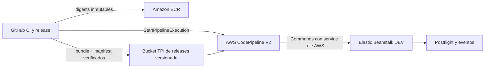

# Arquitectura de promoción a Elastic Beanstalk DEV

Estado: propuesta versionada, no aprovisionada
Ambiente: AWS DEV (`821656895812`, `us-east-2`)
Última validación del baseline: 2026-09-04
Fuente: evidencia AWS DEV, artefacto H3.3 congelado y contratos IAM versionados

## Decisión

Se abandona el despliegue directo GitHub Actions -> Elastic Beanstalk. Las APIs
de Elastic Beanstalk distinguen al caller del service role del environment y
pueden exigir al caller permisos administrativos sobre el bucket gestionado por
Elastic Beanstalk. Conceder esos permisos incrementalmente al principal OIDC de
GitHub mezcla publicación, administración AWS y despliegue en un solo trust
boundary.

El nuevo plano de promoción es:

No se migran los builds Docker a CodeBuild. La acción `Commands` usa compute
administrado únicamente para ejecutar la promoción exacta e idempotente. Se
elige en lugar del provider nativo `ElasticBeanstalk` porque este último solo
acepta `ApplicationName` y `EnvironmentName`; no permite fijar ni reutilizar un
`VersionLabel` concreto.

## Trust boundaries

| Principal | Trust | Responsabilidad | Escrituras permitidas |
| --- | --- | --- | --- |
| `tpi-github-actions-dev-eb-role` | OIDC GitHub, `main` exacto | Preflight/postflight | Ninguna |
| `tpi-github-actions-dev-release-role` | OIDC GitHub, `main` exacto | Publicar artefacto e iniciar/observar un pipeline | Objetos bajo prefijos TPI y ejecución del pipeline DEV |
| `tpi-codepipeline-dev-eb-role` | `codepipeline.amazonaws.com` | Crear/reutilizar versión y actualizar un único environment | EB DEV y contrato S3 exacto |
| Service role de Elastic Beanstalk | `elasticbeanstalk.amazonaws.com` | Operación interna del environment | Según configuración AWS existente |
| Instance profile de Elastic Beanstalk | EC2 | Pull ECR y runtime | Según configuración AWS existente |

GitHub no recibe `s3:CreateBucket`, `s3:PutBucketPolicy`,
`s3:PutBucketPublicAccessBlock`, `s3:PutBucketOwnershipControls`, permisos EB de
escritura ni `AdministratorAccess-AWSElasticBeanstalk`.

## Estrategia de artefactos

Se propone el bucket dedicado y versionado
`tpi-dev-release-artifacts-821656895812-us-east-2`, con bloqueo de acceso público
y cifrado SSE-S3. Separa artefactos propiedad de TPI del bucket administrado por
Elastic Beanstalk.

El workflow descarga el artefacto GitHub existente, verifica el ZIP y manifest,
y los publica sin reconstruir imágenes ni bundle. Luego crea un sobre de
promoción que contiene el bundle original, manifest y scripts versionados. La
acción S3 del pipeline recibe la clave y `VersionId` exactos mediante source
override. El pipeline no sondea el bucket.

Contrato H3.3 inmutable:

| Elemento | Valor |
| --- | --- |
| Runtime SHA | `28cf009137ada707540d9ee7eba01dc45a9a260e` |
| App digest | `sha256:45331812c93bcf905b2ae8ad9eedff9eba5f63bc4afbfd5639af85c78bb3b6ce` |
| Caddy digest | `sha256:1d7c114bf0bb98e8ed2034a37997ee4d9e4aec98cbba58dc00581bbf6b6dc4e2` |
| Bundle SHA256 | `5e998cadee8b2ee08a4fa08f487a8203555c6971da5465427645f66ffb923045` |
| VersionLabel | `h3-3-crm-web-28cf009-r1` |

La versión H3.3 existente puede conservar el `SourceBundle` histórico del
bucket EB, pero solo se reutiliza si bucket y clave coinciden con el contrato
legacy exacto. Una versión nueva se crea desde el objeto equivalente del bucket
TPI dedicado. Cualquier tercera ubicación aborta.

## Recursos con `Resource: "*"`

La propuesta no concede acciones de negocio con `Resource: "*"`. Los permisos
EB se limitan a aplicación, application versions y environment aprobados; S3 se
limita a dos buckets y prefijos exactos; CloudWatch Logs se limita al log group
del pipeline. No se replica la policy amplia publicada como referencia para el
provider EB nativo porque esta arquitectura usa una acción `Commands` y las APIs
explícitas del promotor.

## Reanudabilidad

- Candidato ausente: se crea desde el bundle TPI verificado.
- Candidato existente y source aprobado: se reutiliza.
- Candidato existente con source distinto o `FAILED`: se aborta.
- Environment ya ejecutando el candidato en `Ready / Green / Ok`: no se llama
  `UpdateEnvironment`; se ejecuta postflight.
- Environment en `h2-5d-ecr-47fa0c9` saludable: se permite una promoción.
- Cualquier otro estado o versión: se aborta fail-closed.

El source override usa la versión S3 inmutable y el inicio del pipeline usa un
client token derivado del run. CodePipeline queda en modo `QUEUED` para evitar
promociones paralelas.

## Fallos y evidencia

El promotor obtiene eventos EB ante cualquier excepción, incluso cuando
`UpdateEnvironment` no llegó a ser aceptado. Un fallo del diagnóstico se informa
separadamente y nunca reemplaza la excepción original. GitHub consulta además
las action executions del pipeline y realiza postflight independiente con el
rol read-only.
