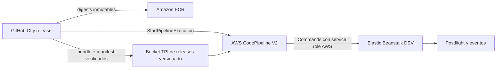

# Arquitectura de promoción a Elastic Beanstalk DEV

Estado: aprovisionada; hardening caller-side pendiente de aplicar
Ambiente: AWS DEV (`821656895812`, `us-east-2`)
Última validación del baseline: 2026-09-07
Fuente: evidencia AWS DEV, artefacto H3.3 congelado y contratos IAM versionados

## Decisión

Se abandona el despliegue directo GitHub Actions -> Elastic Beanstalk. Las APIs
de Elastic Beanstalk distinguen al caller del service role del environment y
pueden exigir al caller permisos administrativos sobre el bucket gestionado por
Elastic Beanstalk. Conceder esos permisos incrementalmente al principal OIDC de
GitHub mezcla publicación, administración AWS y despliegue en un solo trust
boundary.

El nuevo plano de promoción es:

No se migran los builds Docker a CodeBuild. La acción `Commands` usa compute
administrado únicamente para ejecutar la promoción exacta e idempotente. Se
elige en lugar del provider nativo `ElasticBeanstalk` porque este último solo
acepta `ApplicationName` y `EnvironmentName`; no permite fijar ni reutilizar un
`VersionLabel` concreto.

## Trust boundaries

| Principal | Trust | Responsabilidad | Escrituras permitidas |
| --- | --- | --- | --- |
| `tpi-github-actions-dev-eb-role` | OIDC GitHub, `main` exacto | Preflight/postflight | Ninguna |
| `tpi-github-actions-dev-release-role` | OIDC GitHub, `main` exacto | Publicar candidate data e iniciar/observar un pipeline | Un objeto versionado exacto y ejecución del pipeline DEV |
| `tpi-codepipeline-dev-eb-role` | `codepipeline.amazonaws.com` | Verificar, materializar el bundle aprobado, crear/reutilizar versión y actualizar un único environment | Objeto aprobado exacto, EB DEV y contrato S3 exacto |
| Service role de Elastic Beanstalk | `elasticbeanstalk.amazonaws.com` | Operación interna del environment | Según configuración AWS existente |
| Instance profile de Elastic Beanstalk | EC2 | Pull ECR y runtime | Según configuración AWS existente |

GitHub no recibe `s3:CreateBucket`, `s3:PutBucketPolicy`,
`s3:PutBucketPublicAccessBlock`, `s3:PutBucketOwnershipControls`, permisos EB de
escritura ni `AdministratorAccess-AWSElasticBeanstalk`.

## Estrategia de artefactos

Se propone el bucket dedicado y versionado
`tpi-dev-release-artifacts-821656895812-us-east-2`, con bloqueo de acceso público
y cifrado SSE-S3. Separa artefactos propiedad de TPI del bucket administrado por
Elastic Beanstalk.

El workflow descarga el artefacto GitHub existente y verifica el ZIP y manifest
sin reconstruir imágenes ni bundle. Publica únicamente un
ZIP **data-only** que contiene exclusivamente esos dos archivos. La clave S3
está fijada en la definición del pipeline; GitHub solo aporta el `VersionId`
inmutable. `AllowOverrideForS3ObjectKey` está deshabilitado y el pipeline no
sondea el bucket.

Los ejecutables `verify_frozen_candidate.sh` y `promote_eb_candidate.py` viven
en `trusted-tooling/v1/`. Un operador AWS los publica durante el provisioning,
después de verificar los SHA-256 fijados en la definición del pipeline. El rol
GitHub no puede escribir ni leer ese prefijo. Antes de ejecutar cada archivo,
la acción `Commands` lo descarga y valida su hash. Por tanto, modificar el
source data-only, conservar su nombre o intentar incluir scripts no cambia el
código ejecutado con el service role.

Tras la verificación, el promotor confiable recalcula el SHA-256 de los bytes
del bundle extraído y los publica con checksum S3 en el objeto exacto:

`approved-releases/h3-3-crm-web-28cf009-r1/5e998cadee8b2ee08a4fa08f487a8203555c6971da5465427645f66ffb923045.zip`

Luego vuelve a leer el checksum almacenado. Solo después puede crear una
Application Version usando ese objeto. GitHub no tiene acceso de escritura a
`approved-releases/` ni publica una segunda copia del bundle. La metadata S3 es
solo observabilidad y no constituye la prueba de integridad.

El artifact store interno de CodePipeline usa un segundo bucket,
`tpi-dev-codepipeline-artifacts-821656895812-us-east-2`, que GitHub tampoco
puede consultar ni modificar.

Contrato H3.3 inmutable:

| Elemento | Valor |
| --- | --- |
| Runtime SHA | `28cf009137ada707540d9ee7eba01dc45a9a260e` |
| App digest | `sha256:45331812c93bcf905b2ae8ad9eedff9eba5f63bc4afbfd5639af85c78bb3b6ce` |
| Caddy digest | `sha256:1d7c114bf0bb98e8ed2034a37997ee4d9e4aec98cbba58dc00581bbf6b6dc4e2` |
| Bundle SHA256 | `5e998cadee8b2ee08a4fa08f487a8203555c6971da5465427645f66ffb923045` |
| VersionLabel | `h3-3-crm-web-28cf009-r1` |

La versión H3.3 existente puede conservar el `SourceBundle` histórico del
bucket EB, pero solo se reutiliza si bucket y clave coinciden con el contrato
legacy exacto. También se reutiliza si apunta al objeto aprobado exacto. Una
versión ausente se crea exclusivamente desde el objeto AWS-controlled bajo
`approved-releases/`. Cualquier tercera ubicación aborta.

La reutilización también valida bytes. Para el source aprobado se exige el
`ChecksumSHA256` S3 correspondiente al bundle congelado. Para el source legacy,
que no dispone necesariamente de ese checksum, CodePipeline descarga el objeto
y calcula SHA-256 localmente. Bucket y clave correctos con contenido distinto
aborta antes de `UpdateEnvironment`; la metadata histórica no se considera
prueba de integridad.

## Contrato caller-side de Elastic Beanstalk

`UpdateEnvironment` es una operación compuesta. Aunque el environment conserva
sus propios roles, Elastic Beanstalk también comprueba permisos del caller sobre
CloudFormation y los recursos que CloudFormation actualiza. La ejecución
`fbd91cee-1fe7-4535-8025-cd9f98a58fc9` confirmó esta frontera al denegar
`cloudformation:GetTemplate` sobre `awseb-e-sd5gmkxr5r-stack`.

La inspección física posterior confirmó `RoleARN = null`: el stack no tiene un
service role de CloudFormation y usa credenciales derivadas del caller. El stack
está en `UPDATE_COMPLETE` y contiene exclusivamente estos tipos:

- `AWS::AutoScaling::AutoScalingGroup`;
- `AWS::EC2::LaunchTemplate`;
- `AWS::EC2::EIP`;
- `AWS::CloudFormation::WaitCondition`;
- `AWS::CloudFormation::WaitConditionHandle`.

El ASG observado es
`awseb-e-sd5gmkxr5r-stack-AWSEBAutoScalingGroup-MkPjH46TJf2L`, conserva el tag
`aws:cloudformation:stack-name = awseb-e-sd5gmkxr5r-stack` y usa
`AWSServiceRoleForAutoScaling`. El Launch Template observado es
`lt-0c69191d0013fa448`, versión 1, y no tiene tags de CloudFormation.

La policy administrada `AdministratorAccess-AWSElasticBeanstalk` se usa solo
como referencia de acciones; no se adjunta ni se copia completa. Para H3.3 se
incorpora el subconjunto aplicable a actualizar el stack existente:

- inspección: `DescribeStackEvents`, `DescribeStackResource`,
  `DescribeStackResources`, `DescribeStacks`, `GetTemplate` y
  `ListStackResources`;
- actualización controlada: `UpdateStack` y `SignalResource`.

Todas se restringen a
`arn:aws:cloudformation:us-east-2:821656895812:stack/awseb-e-sd5gmkxr5r-stack/*`.
No se conceden operaciones de creación/eliminación del stack ni recuperación
manual: no forman parte de la promoción normal H3.3.

### Matriz caller-side observada

| AWS action | Motivo | Resource scope |
| --- | --- | --- |
| `cloudformation:DescribeStack*`, `GetTemplate`, `ListStackResources` | Inspección y reconciliación del stack existente | ARN exacto `awseb-e-sd5gmkxr5r-stack/*` |
| `cloudformation:UpdateStack`, `SignalResource` | Aplicar la Application Version y coordinar sus `WaitCondition` | ARN exacto del stack |
| `autoscaling:DescribeAutoScalingGroups`, `DescribeAutoScalingInstances`, `DescribeScalingActivities`, `DescribeScalingProcessTypes` | Inspeccionar el ASG y el rolling update | `*`, porque estas APIs no admiten resource-level scope; limitado a `us-east-2` |
| `autoscaling:UpdateAutoScalingGroup`, `SuspendProcesses`, `ResumeProcesses`, `TerminateInstanceInAutoScalingGroup` | Actualizar la referencia del Launch Template y ejecutar el rolling update | ASG `awseb-e-sd5gmkxr5r-*`, tag del stack exacto y región DEV |
| `ec2:DescribeLaunchTemplates`, `DescribeLaunchTemplateVersions` | Resolver versiones del Launch Template | `*`, limitado por región porque estas APIs no admiten ARN |
| `ec2:CreateLaunchTemplateVersion`, `DeleteLaunchTemplateVersions` | Crear la versión con el nuevo source bundle y limpiar versiones de esa actualización | ARN exacto `launch-template/lt-0c69191d0013fa448` |
| `ec2:DescribeAddresses` | Reconciliar el `AWS::EC2::EIP` observado sin modificarlo | `*`, limitado por región |

No se conceden mutaciones EIP porque cambiar la Application Version no cambia
ese recurso. Tampoco `ModifyLaunchTemplate`: CloudFormation administra las
versiones del recurso, no su versión default. Se excluyen además `RunInstances`,
`CreateLaunchTemplate`, `DeleteLaunchTemplate`, `CreateAutoScalingGroup`,
`DeleteAutoScalingGroup` e `iam:PassRole`, por ser operaciones de lifecycle o
identidad fuera de H3.3. Los lanzamientos posteriores del ASG usan su
service-linked role observado, no el service role de CodePipeline. No se agregan
ELB, RDS o ECS porque esos tipos no existen en el stack inspeccionado.

`CreateLaunchTemplateVersion` es una capacidad privilegiada: una versión puede
referenciar un instance profile. Los controles compensatorios son el ARN exacto
del Launch Template, el service role no asumible directamente por GitHub, el
tooling privilegiado fuera del control de escritura de GitHub, sus hashes
SHA-256, el candidate congelado y el pipeline/Application Version exactos.

Referencias usadas para derivar el contrato:

- [policy administrada vigente de Elastic Beanstalk](https://docs.aws.amazon.com/aws-managed-policy/latest/reference/AdministratorAccess-AWSElasticBeanstalk.html), solo como límite superior de acciones;
- [permisos caller-side de Elastic Beanstalk](https://docs.aws.amazon.com/elasticbeanstalk/latest/dg/concepts-roles-user.html);
- [permisos requeridos para Launch Templates](https://docs.aws.amazon.com/elasticbeanstalk/latest/dg/environments-cfg-autoscaling-launch-templates.html);
- [acciones y recursos de Auto Scaling](https://docs.aws.amazon.com/service-authorization/latest/reference/list_autoscaling.html).

## Recursos con `Resource: "*"`

La única statement con `Resource: "*"` contiene exclusivamente operaciones
`Describe` de Auto Scaling y EC2 que no admiten resource-level permissions. Se
limita con `aws:RequestedRegion = us-east-2`. Todas las mutaciones usan ARN y
tags del stack DEV. Una acción futura que no admita resource-level permissions
requerirá evidencia física, justificación y revisión separada.

## Contrato S3 administrado por Elastic Beanstalk

La policy AWS vigente para Elastic Beanstalk contempla el siguiente contrato
sobre buckets `elasticbeanstalk-*`. Se adopta completo para evitar ampliaciones
reactivas, pero se restringe al bucket físico exacto de la cuenta DEV:

| Nivel | Referencia AWS | Contrato propuesto | Scope |
| --- | --- | --- | --- |
| Bucket | `CreateBucket` | Incluido | bucket EB exacto |
| Bucket | `GetBucket*` | Incluido | bucket EB exacto |
| Bucket | `ListBucket` | Incluido | bucket EB exacto |
| Bucket | `PutBucketPolicy` | Incluido | bucket EB exacto |
| Bucket | `PutBucketPublicAccessBlock` | Incluido | bucket EB exacto |
| Bucket | `PutBucketOwnershipControls` | Incluido | bucket EB exacto |
| Objetos | `Get*` | Incluido | objetos del bucket EB exacto |
| Objetos | `Put*` | Incluido | objetos del bucket EB exacto |
| Objetos | `Delete*` | Incluido | objetos del bucket EB exacto |

No se excluye ninguna acción de ese contrato S3 publicado. La reducción se
realiza por recurso: no hay wildcard de nombre de bucket, otros buckets, otras
cuentas ni otras regiones. Estos permisos pertenecen exclusivamente al service
role de CodePipeline y no al principal OIDC de GitHub. No se adjunta
`AdministratorAccess-AWSElasticBeanstalk`.

## Reanudabilidad

- Candidato ausente: CodePipeline materializa el bundle verificado en el objeto
  aprobado y crea la versión desde ese objeto.
- Candidato existente y source aprobado: se reutiliza.
- Candidato existente con source distinto o `FAILED`: se aborta.
- Environment ya ejecutando el candidato en `Ready / Green / Ok`: no se llama
  `UpdateEnvironment`; se ejecuta postflight.
- Environment en `h2-5d-ecr-47fa0c9` saludable: se permite una promoción.
- Cualquier otro estado o versión: se aborta fail-closed.

El source override usa la versión S3 inmutable y el inicio del pipeline usa un
client token derivado del run. CodePipeline queda en modo `QUEUED` para evitar
promociones paralelas.

## Fallos y evidencia

El promotor obtiene eventos EB ante cualquier excepción, incluso cuando
`UpdateEnvironment` no llegó a ser aceptado. Un fallo del diagnóstico se informa
separadamente y nunca reemplaza la excepción original. GitHub consulta además
las action executions del pipeline y realiza postflight independiente con el
rol read-only.
