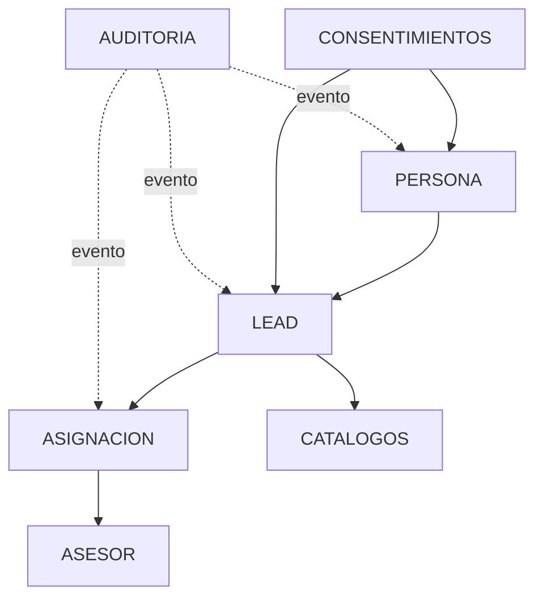

Estado: vigente
Ambiente validado: AWS DEV
Ultima validacion fisica: 2026-08-28
Fuente: PostgreSQL RDS + scripts versionados + init_test_database.py

# 01 Architecture

## Scope

This document describes the conceptual and operational database model used by
the CRM Lite backoffice.

It does not define SQL DDL. It explains the responsibilities of each entity and
the boundaries between operational relations, traceability, and ingestion-only
payloads.

## Data Model

## Entity Responsibilities

### `tpi.personas`

- stores the physical identity of a person captured by the CRM
- keeps contact and demographic data required by the backoffice
- acts as the parent for lead creation and consent capture

### `tpi.leads`

- stores the current CRM lead record
- owns the lead status lifecycle
- links one lead to one person
- keeps ingestion metadata and auxiliary source payload

### `tpi.asignaciones`

- stores the operational lead-to-advisor relation
- is the formal source of truth for who owns the lead
- supports history naturally by preserving assignment rows
- must not be replaced by `raw_payload`

### `tpi.asesores`

- stores the advisor entity used by the CRM
- is the destination of assignment
- the UI may call this role "Ejecutivo", but the domain and persistence
  layer must remain on `asesor` / `id_asesor`

### `tpi.auditoria`

- stores traceability events for business operations
- captures who performed the action, on which lead, and what changed
- is not a replacement for operational relationships

### `tpi.consentimientos`

- stores consent capture and legal acceptance metadata
- references the person and optionally the lead
- is part of the onboarding/registration flow, not the assignment relation

### Catalog tables

- `tpi.catalogo_afp`
- `tpi.catalogo_genero`
- `tpi.catalogo_estado_civil`

These tables provide controlled reference data used by registration and
health checks.

## Raw Payload Boundary

`leads.raw_payload` may keep original ingestion material or non-operational
metadata that belongs to the source contract.

It must not be used as the operational source of relationships such as:

- advisor assignment
- lead ownership
- assignment history

## Actor vs Advisor

The authenticated actor and the destination advisor are different concepts.

- actor: the authenticated user who performs the operation
- advisor: the selected `id_asesor` that receives the lead

Do not collapse them into a single identity unless a future feature explicitly
requires auto-assignment or advisor mapping.

## Validation Source

- AWS DEV is the physical reference for tables already inspected there.
- `scripts/init_test_database.py` is the contract used to reproduce the schema
  in testing.
- repository SQL scripts declare the versioned target state.

## Pending Definitions

- cross-table analytics model for future reassignment
- formal mapping from auth identity to advisor identity
- catalog governance for lead states

