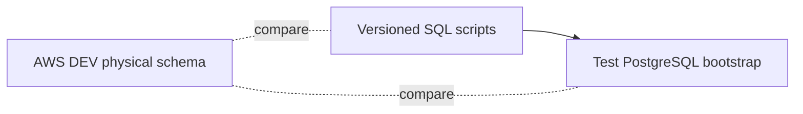

Estado: vigente
Ambiente validado: AWS DEV
Ultima validacion fisica: 2026-08-28
Fuente: PostgreSQL RDS + scripts versionados + init_test_database.py

# 07 Testing and Integrity

## Why Mocks Are Not Enough

Mocks can prove that code calls a method.

They cannot prove:

- foreign key enforcement
- partial UNIQUE enforcement
- transaction rollback on constraint failure
- row locking behavior
- concurrent write conflict handling

Those behaviors must be verified against a real PostgreSQL instance.

## Test Layers

### Unit tests

Use mocks and fixtures for:

- settings resolution
- validation errors
- safe logging
- healthcheck messages
- URL contract and UI formatting

### Integration tests

Use PostgreSQL and the real repository/service layer for:

- inserts and updates
- rollback behavior
- audit row generation
- assignment logic
- active assignment conflicts
- concurrent assignment attempts

### E2E tests

Use the web UI to validate:

- assignment flow
- URL contracts
- business-visible state changes
- access boundaries

## Test Database Bootstrap

`scripts/init_test_database.py` recreates the schema contract used by CI.

It provides:

- `tpi.personas`
- `tpi.leads`
- `tpi.asesores`
- `tpi.asignaciones`
- `tpi.auditoria`
- `tpi.consentimientos`
- catalog tables
- `tpi.api_idempotency`
- the partial UNIQUE index for one active assignment per lead
- a dedicated restricted runtime role for assignment tests:
  - `tpi_assignment_runtime`
  - `tpi_assignment_runtime_password`
  - exact privileges needed by the H3.3 assignment flow

This is how the test environment reproduces the relevant PostgreSQL contract
without depending on AWS DEV.

## Integrity Checks Covered by Tests

- assignment creates a row
- lead moves to `asignado`
- audit row is written
- transaction rolls back when any step fails
- unique partial index blocks a second active assignment
- concurrency leaves exactly one active row

## Schema Drift Detection

The three surfaces must be compared regularly:

1. AWS DEV physical state
2. repository versioned contract
3. test bootstrap contract

If they diverge, the difference must be recorded explicitly before release.

## What to Verify Before Closing H3.3

- the assignment service remains transactional
- `estado_lead='asignado'` is only reachable through `assign_lead`
- `asignado_por` preserves a stable actor identifier
- `tpi.asignaciones` remains the operational relation
- `tpi.auditoria` contains traceability metadata without storing unnecessary PII
- assignment tests run once under a restricted PostgreSQL role so privilege
  regressions fail in integration instead of only in AWS

## Relevant Test Files

- `tests/unit/test_database_settings.py`
- `tests/unit/test_database_connection.py`
- `tests/unit/test_database_healthcheck.py`
- `tests/integration/test_database_runtime.py`
- `tests/integration/test_web_crm_lite.py`
- `tests/e2e/test_consulta_solicitudes.py`
- `tests/e2e/test_registro_solicitud.py`
- `tests/e2e/test_streamlit_app.py`
