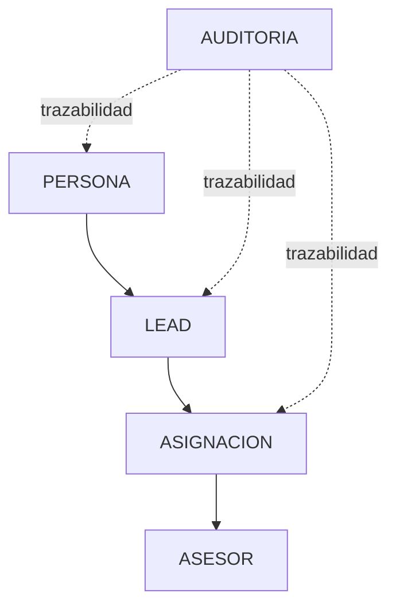

Estado: vigente
Ambiente validado: AWS DEV
Ultima validacion fisica: 2026-08-28
Fuente: PostgreSQL RDS + scripts versionados + init_test_database.py

# Database Documentation

This directory is the navigation entry point for the database layer of the
Tu Pension Inteligente backoffice.

It separates three different realities on purpose:

1. Physical state currently deployed in AWS DEV.
2. Versioned contract declared by repository scripts and bootstrap.
3. Future target state that will exist only after pending migrations.

Do not treat the diagram image `Estructura BD.jpg` as source of truth. It is a
local reference artifact and is intentionally not versioned here.

## What This Directory Covers

- purpose of the data layer
- environments and their contract
- conceptual and operational model
- physical schema observed in AWS DEV
- versioned migrations and bootstrap scripts
- security, roles, and secrets handling
- operations runbook
- testing and integrity strategy

## When To Read Each Document

| Need | Read this |
| ---- | --------- |
| Understand the domain and data flow | [01_ARCHITECTURE.md](01_ARCHITECTURE.md) |
| Inspect table/column/constraint reality | [02_PHYSICAL_SCHEMA.md](02_PHYSICAL_SCHEMA.md) |
| Review business invariants and state rules | [03_BUSINESS_RULES.md](03_BUSINESS_RULES.md) |
| Review versioned schema scripts | [04_MIGRATIONS.md](04_MIGRATIONS.md) |
| Review roles, SSL, and access control | [05_SECURITY_ACCESS.md](05_SECURITY_ACCESS.md) |
| Run validation, apply migration, or rollback | [06_OPERATIONS_RUNBOOK.md](06_OPERATIONS_RUNBOOK.md) |
| Understand test reproduction and integrity gates | [07_TESTING_AND_INTEGRITY.md](07_TESTING_AND_INTEGRITY.md) |

## Environments

| Environment | Purpose | Notes |
| ----------- | ------- | ----- |
| Local | Developer workstation | `.env` allowed, not versioned |
| Testing | Isolated PostgreSQL for CI and integration tests | Recreated from repo bootstrap |
| AWS DEV | Physical reference for H3.3 | Inspected read-only and used as current physical contract |
| Production | Future target | Not yet part of this release scope |

## Model Summary



```text
PERSONA
   ↓
LEAD
   ↓
ASIGNACION
   ↓
ASESOR

AUDITORIA
   ↳ trazabilidad de las operaciones
```

## Source Discipline

- `tpi.asignaciones` is the formal source of truth for the lead-advisor relation.
- `leads.raw_payload` is not an operational relation store.
- `estado_lead='asignado'` only makes sense as the result of a valid assignment.
- Physical AWS DEV is the reference for what exists today.
- Versioned SQL scripts are the reference for what should exist after pending migrations.

